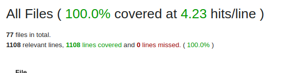

### Execução

Ao clonar o projeto, vá até a pasta raiz do projeto e execute:

```bash
  docker-compose up -d
```

Com isso a aplicação já estará de pé, respondendo no endereço: `http://localhost:3030`. O servidor de email local vai responder no endereço `http://localhost:1080`.

A documentação a seguir deve ajudar a testar:

- [Postman collection](backend/public/doc/postman_collection.json)
- [Swagger HTML arquivo](backend/public/doc/openapi.html)
- [Swagger Link](http://localhost:3030/api-doc)

### Como testar a aplicação

*Obs. Para melhor funcionamento do cookie de sessão utilize o postman para executar os testes manuais.*

Recomendo que importe o arquivo collection em seu aplicativo postman. Uma vez importado siga os seguintes passos:

- Utilize a rota `auth/signup` para criar um novo usuário.
- Vá até [este](http://localhost:1080) enderço de email encontre o email com título `Registration Confirmation`.
- Dentro do email haverá o token que deverá ser utilizado para logar o usuario e um link para ativar o email antes do primeiro login.
- Copie/cole no postman o endereço para ativar o email.
- Uma vez ativado, faça o login na rota `auth/login` se utilizando do token informado no email. Caso tenha utilizado o mesmo client postman para ativar o email, este passo não será necessário.
- Agora pode utilizar todas as rotas de `insurances`.

### Testes unitários

Para rodar os testes, basta executar:

```bash
  docker-compose run --rm backend rspec
```

### Covertura de código



### Solução:

Priorizei o backend e o uso da gem `u-case` para testa-la principalmente pois ela permite uma arquitetura orientada a caso de uso, deixando o código mais preparado para evolução e testes isolados.

### Coisas que podem melhorar

- Transferir validações do modelo para os casos de uso, tive dificuldade de lidar com os testes manuais `validate: method`.
- Remover duplicações de casos de uso.
- Implementar serializers
- Serializar erros específicos e tratar com mais carinhos os status code em caso de erro.
- Remover sobrescrita do método `attributes` de um `Micro::Case`, foi necessários pq não vejo o pq retornar um hash usando string como chave e sugerir essa feature na gem.
- Evitar uso de cookie de sessão para melhorar a segurança.
